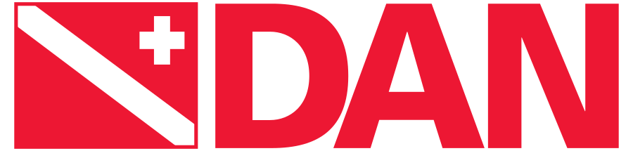
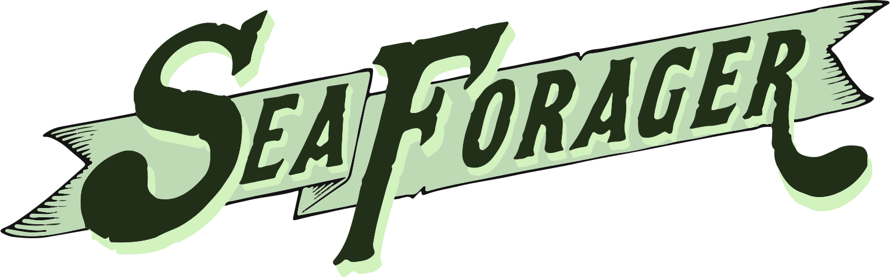
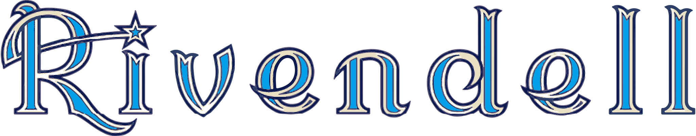

I'm a product manager at &nbsp;[{: width="72" style="vertical-align: -.025em"}](http://intrinsic.ai), which I co-founded at &nbsp;{: width="76" style="vertical-align: -0.205em"}'s &nbsp;[{: width="15" style="vertical-align: 0em"}](http://x.company)&nbsp; moonshot factory.
Our mission is to democratize access to industrial robotics.

Prior to that, I started &nbsp;[{: width="110" style="vertical-align: -0.15em"}](http://beatbots.net)&nbsp; with [Hideki Kozima](http://www.ei.tohoku.ac.jp/xkozima/index-eng.html), designer of the &nbsp;[{: width="85" style="vertical-align: -0.175em"}](http://beatbots.net/keepon-pro)&nbsp; robot.
We created a family of robotic toys & characters, including [Zingy](http://beatbots.net/zingy), a mascot for &nbsp;[{: width="60" style="vertical-align: -0.03em"}](https://edfenergy.com).
Other ongoing projects of mine include &nbsp;[{: width="135" style="vertical-align: 0em"}](http://dirtyro.bot) Brew Works and the &nbsp;[{: width="120" style="vertical-align: 0em"}](http://robot.film). Please see my [Portfolio](/portfolio) for more about what I've gotten up to.

A few things I enjoy:
I practice karate with [月影流](http://facebook.com/tkrsf).
• I'm a &nbsp;[{: width="64" style="vertical-align: 0em" }](http://padi.com)&nbsp; advanced open water diver, a [{: width="66" style="vertical-align: 0em" }](http://dan.org) member, and a supporter of [{: width="95" style="vertical-align: -.5em" }](http://seaforager.com)'s sustainable seafood.
• I have a dormant Private Pilot license that I hope to revive some day.
• I'm a member of [The Long Now Foundation](http://longnow.org){: style="font-variant: small-caps"}.
• Over the years I've shifted from motorcycles to bicycles (with a fondness for [{: width="90" style="vertical-align: -.1em" }](http://rivbike.com)'s), and I love skiing (increasingly in the backcountry) & backpacking.

I was born in Poland, grew up in New York, spent some years in Japan, and live in San Francisco.
I studied computer science, psychology, & robotics at [{: width="40" style="vertical-align: -0.025em"}](http://yale.edu) (BA'02, MS'03) & [{: width="140" style="vertical-align: -0.28em"}](http://www.ri.cmu.edu) (PhD'10).
My [thesis](https://www.proquest.com/openview/4891551287a3aa725779cef8f8f9be15) on rhythmic human-robot social interaction was sponsored by the [NSF](http://nsf.gov) & Japan's [NICT](https://www.nict.go.jp/en).
